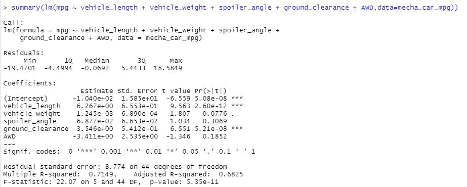

# MechaCar_Statistical_Analysis
## Deliverable 1
### Linear Regression to Predict MPG

### Summary
#### Question 1: Which variables/coefficients provided a non-random amount of variance to the mpg values in the dataset?
According to p-value, vehicle_length and ground_clearence provide a suitable non-random amount of variance to the mpg values. 

#### Question 2: Is the slope of the linear model considered to be zero? Why or why not?
According to the extremely small p-value, (5.35e-11), which is far smaller than our assumed significance level of 0.05, the slope of the linear model is considered NOT to be 0, therefore we can reject the null hypothesis that the slope is equal to 0.

#### Question 3: Does this linear model predict mpg of MechaCar prototypes effectively? Why or why not?
The r-squared value of 0.715 suggests a 71.5% likelihood that this linear model predicts the relationship between variables effectively.

## Deliverable 2
### Summary Statistics on Suspension Coils
### Summary
#### Question 1: The design specifications for the MechaCar suspension coils dictate that the variance of the suspension coils must not exceed 100 pounds per square inch. Does the current manufacturing data meet this design specification for all manufacturing lots in total and each lot individually? Why or why not?

## Deliverable 3
## Deliverable 4
