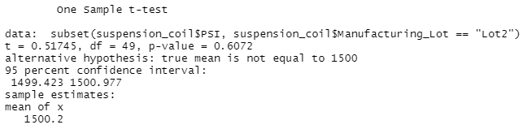

# MechaCar_Statistical_Analysis
## Deliverable 1
### Linear Regression to Predict MPG

### Summary
#### Question 1: Which variables/coefficients provided a non-random amount of variance to the mpg values in the dataset?
According to p-value, vehicle_length and ground_clearence provide a suitable non-random amount of variance to the mpg values. 

#### Question 2: Is the slope of the linear model considered to be zero? Why or why not?
According to the extremely small p-value, (5.35e-11), which is far smaller than our assumed significance level of 0.05, the slope of the linear model is considered NOT to be 0, therefore we can reject the null hypothesis that the slope is equal to 0.

#### Question 3: Does this linear model predict mpg of MechaCar prototypes effectively? Why or why not?
The r-squared value of 0.715 suggests a 71.5% likelihood that this linear model predicts the relationship between variables effectively.

## Deliverable 2
### Summary Statistics on Suspension Coils
#### Total Summary

#### Lot Summary

### Summary
#### Question 1: The design specifications for the MechaCar suspension coils dictate that the variance of the suspension coils must not exceed 100 pounds per square inch. Does the current manufacturing data meet this design specification for all manufacturing lots in total and each lot individually? Why or why not?
In looking at the total summary dataframe, the variances comes in at 62.29, which falls under the standard of not exceeding 100 pounds per square inch. However, once examining the lot dataframe, which seperates the information by lot number, it becomes clear that although Lot 1 and 2 have acceptable variances at 0.98 and 7.47 respectively, Lot 3 fails to meet the safety standard as its variance far exceeds the standard of 100 pounds per square inch.

## Deliverable 3

### T-Tests On Suspension Coils
#### All Lots

#### Lot 1

#### Lot 2

#### Lot 3

### Summary
#### All Lots
With a p-value of 0.06, which exceeds the significance level of 0.05, we fail to reject the null hypothesis that the true mean is equal to 1500.
#### Lot 1
With a p-value of 1, which exceeds the signficance level of 0.05, we fail to reject the null hypothesis that the true mean is equal to 1500.
#### Lot 2
With a p-value of 0.61, which exceeds the significance level of 0.05, we fail to reject the null hypothesis that the true mean is equal to 1500.
#### Lot 3
With a p-value of 0.42, which falls below the significance level of 0.05, we succeed in rejecting the null hypothesis, instead confirming the alternative hypothesis that the true mean is NOT equal to 1500.

## Deliverable 4

### Study Design: MechaCar vs. Competition
#### Description
In order to aid in my search of a new vehicle, I wish to compare the highway fuel efficiency amongst MechaCar and their leading competition. 

#### What metric or metrics are you going to test?
- MPG
- Vehicle Size
- Horsepower
#### Null hypothesis?
MechaCar has a higher highway fuel efficiency than other brands.
#### Alternative hypothesis?
MechaCar has a lower highway fuel efficiency than other brands.
#### What statistical test would you use to test the hypothesis? And why?
I think the best test for this analysis would be to run a one-sample t-test to compare the distribution means and evaluate whether there is a statistical difference between MechaCar (using it as the mean) and their leading competitor. This would provide the information as to whether highway fuel efficiency is higher, lower, or the same.
#### What data is needed to run the statistical test?
I would need vehicle specs from each manufacturer as well as their performance information given equal conditions.
